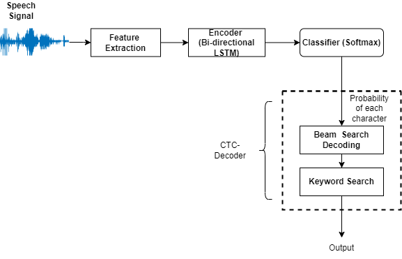

## End-to-End Keyword Spotting (E2E-KWS) using a character level  LSTM 

Our model is similar to the transcription model used for ASR task in [1]. We adopted this model and trained sequence to sequence using connectionist temporal classification loss (CTC in short) on character level for keyword spotting task. We call our model  "CTC-based RNN"  First, we train the model using 1000 hours of librispeech.  Then, we retrain the librispeech trained model by varying the size of the Google Speech Commands (V2) dataset. Using 100% training material of GSC, we obtained STOA accuracy for the 12-commands recognition task and competitive performance for the 35-commands recognition task. In addition, the performance is not worse even after retraining with less percentage (i.e., 5%,25%, 50%, and 75%) of GSC training material. In what follows, the results of our experiments are depicted.  


## File description
* model.py: RNN model
* train_ctc_kws.py: ctc acoustic model training script
* eval.py: evaluation script
* DataLoader.py: the audio features are extracted here


## Our proposed KWS architecure  



## Run


* Train CTC acoustic model
```
python train_ctc_kws.py --lr 1e-5 --bi --dropout 0.5 --out exp/ctc_bi_lr1e-3 --schedule
```


* Decode 
```
python eval.py <path to best model> [--ctc] --bi
```

## Results

|model|Accuracy (12-V2) |Accuracy (35-V2)|
|:-----------------:|:-------:|:-------:|
|CTC-based RNN(our model)  |98.95 | 95.85|


## Requirements
* Python 3.6
* PyTorch >= 0.4
* numpy 1.14
## Paper
* https://ieeexplore.ieee.org/document/9746012
## Reference
* [1] RNN Transducer (Graves 2012): [Sequence Transduction with Recurrent Neural Networks](https://arxiv.org/abs/1211.3711)
